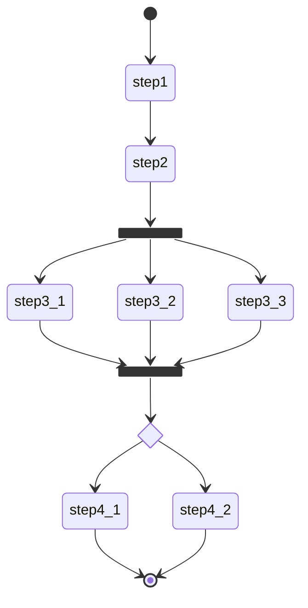

示例 api 编排场景。

在应用集成的过程中经常会遇到要按照一定的顺序和规则执行一组 apis 的情况。其中的顺序和规则可能是短生命周期的，需要经常的变化，因此，需要有一种编排 apis 的轻量级方法。



上面的图代表了一个编排需求，其中每个 step 代表一个要被调用的 api，step3_x 是要并行执行的 apis，step4_x 是两个需要根据条件选择执行的 apis。

# 运行

```sh
mvn clean package
```

```sh
java -Dcamel.springboot.routes-include-pattern='file:routes/*.xml' -jar ./target/apiflow-1.0-SNAPSHOT.jar
```

```sh
curl 'http://localhost:8081/flows/flow01'
```

服务端输出的日志

```
2023-12-20T14:10:02.841+08:00  INFO 21816 --- [tp1410514922-28] orchestration.xml:10                     : flow01 start
2023-12-20T14:10:02.848+08:00  INFO 21816 --- [tp1410514922-33] apis.xml:28                              : step_1
2023-12-20T14:10:02.856+08:00  INFO 21816 --- [tp1410514922-34] apis.xml:35                              : step_2
2023-12-20T14:10:02.864+08:00  INFO 21816 --- [tp1410514922-30] apis.xml:52                              : step_3_2
2023-12-20T14:10:02.864+08:00  INFO 21816 --- [tp1410514922-31] apis.xml:42                              : step_3_1
2023-12-20T14:10:02.864+08:00  INFO 21816 --- [tp1410514922-45] apis.xml:62                              : step_3_3
2023-12-20T14:10:03.472+08:00  INFO 21816 --- [tp1410514922-33] apis.xml:79                              : step_4_2
2023-12-20T14:10:03.475+08:00  INFO 21816 --- [#11 - Multicast] orchestration.xml:52                     : flow01 end
```

curl 调用返回的结果

```
step_1,step_2,step_3_3:step_3_2:step_3_1,step_4_2
```

```sh
curl 'http://localhost:8081/flows/flow01?case=case01'
```

服务端输出日志

```
2023-12-20T14:10:31.753+08:00  INFO 21816 --- [tp1410514922-34] orchestration.xml:10                     : flow01 start
2023-12-20T14:10:31.757+08:00  INFO 21816 --- [tp1410514922-45] apis.xml:28                              : step_1
2023-12-20T14:10:31.765+08:00  INFO 21816 --- [tp1410514922-49] apis.xml:35                              : step_2
2023-12-20T14:10:31.773+08:00  INFO 21816 --- [tp1410514922-35] apis.xml:42                              : step_3_1
2023-12-20T14:10:31.774+08:00  INFO 21816 --- [tp1410514922-33] apis.xml:52                              : step_3_2
2023-12-20T14:10:31.774+08:00  INFO 21816 --- [tp1410514922-31] apis.xml:62                              : step_3_3
2023-12-20T14:10:32.381+08:00  INFO 21816 --- [tp1410514922-30] apis.xml:72                              : step_4_1
2023-12-20T14:10:32.384+08:00  INFO 21816 --- [#20 - Multicast] orchestration.xml:52                     : flow01 end
```

curl 调用返回的结果

```
step_1,step_2,step_3_3:step_3_2:step_3_1,step_4_1
```

# 路由

## apis.xml

模拟被调用 apis。

给`step_3_x`的 apis 添加了延时，用于模拟要执行一定时间的调用。

```xml
<route id="step_3_1">
  <from uri="direct:step_3_1" />
  <log message="step_3_1" />
  <delay>
    <constant>600</constant>
  </delay>
  <transform>
    <constant>step_3_1</constant>
  </transform>
</route>
```

## orchestration.xml

将 api 调用返回的结果保存在`exchange`对象中。

```xml
<to
  uri="rest:get:/apis/step_1?host=localhost:8081&amp;bridgeEndpoint=true" />
<setProperty name="result.step_1">
  <simple>${body}</simple>
</setProperty>
```

并行执行

```xml
<multicast parallelProcessing="true"
  aggregationStrategy="#class:jasony62.camel.JoinAggregationStrategy" streaming="true">
  <to uri="direct:flow_step_3_1" />
  <to uri="direct:flow_step_3_2" />
  <to uri="direct:flow_step_3_3" />
</multicast>
```

**注意**：默认情况下，并行执行时，只会将代码中最后一个执行步骤（step_3_3）的结果作为整体结果返回。若要处理每一步的结果，需要实现`aggregationStrategy`。默认情况下，是按照代码中的顺序处理结果，如果要按照执行完成顺序，需要设置`streaming="true"`。

条件执行

```xml
<choice>
  <when>
    <simple>${header.case} == 'case01'</simple>
    <to
      uri="rest:get:/apis/step_4_1?host=localhost:8081&amp;bridgeEndpoint=true" />
  </when>
  <otherwise>
    <to
      uri="rest:get:/apis/step_4_2?host=localhost:8081&amp;bridgeEndpoint=true" />
  </otherwise>
</choice>
```

# 代码

`JoinAggregationStrategy`实现了`AggregationStrategy`接口，用于合并处理多个并行执行步骤的结果。

# 参考

https://camel.apache.org/components/4.0.x/rest-component.html

https://camel.apache.org/components/4.0.x/eips/multicast-eip.html

https://camel.apache.org/components/4.0.x/eips/choice-eip.html

https://camel.apache.org/components/4.0.x/eips/message.html

https://camel.apache.org/components/4.0.x/eips/setHeader-eip.html

https://camel.apache.org/components/4.0.x/eips/setProperty-eip.html
